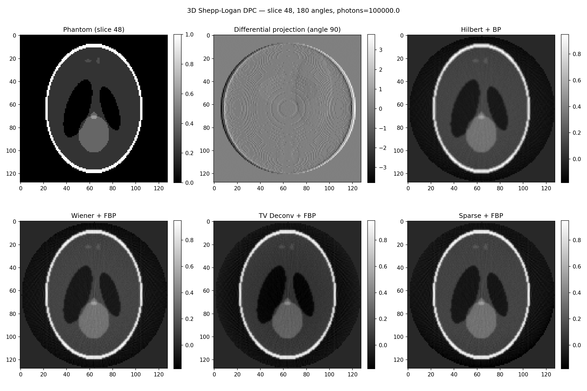

# DeconvDPC

Phase integration and reconstruction in 1D Differential Phase Contrast (DPC) Computed Tomography (CT)

This package provides tools for image deconvolution and reconstruction using various approaches:
- **Hilbert transform** - Phase recovery plus backprojection
- **Wiener deconvolution** - Classical frequency-domain method 
- **Sparse deconvolution** - Iterative shrinkage approach
- **Total variation deconvolution** - TV-regularized deconvolution

## Quick Start

### Installation

The ASTRA toolbox is used for the CT reconstruction. See https://astra-toolbox.com/docs/install.html for its installation. This dependency is not included into [requirements.txt](requirements.txt).

```bash
git clone https://github.com/francescobrun/deconvDPC.git
cd deconvDPC
pip install -r requirements.txt
```

### Basic Usage

```bash
python run.py config.yaml
```

### Configuration

Modify the following [config.yaml](config.yaml) to tune the available parameters.

```yaml
phantom_params:
  voxel_grid: 256
  FOV_cm: 30

noise:
  photon_count: 1e5

deconv_params:
  wiener_v0: 1e-5
  sparse_we: 0.01
  tv_lambda: 0.1

paths:  
  output_dir: ./output
  add_plot: True  
```

### Configuration

At the end of the execution a similar plot is produced in the specified output folder:




## Citation

If you use DeconvDPC in your research, please cite:

```bibtex
@article{Rizzo2026,
title = {A flexible deconvolution-based reconstruction pipeline for edge illumination phase-contrast computed tomography},
journal = {Tomography of Materials and Structures},
volume = {10},
pages = {100081},
year = {2026},
issn = {2949-673X},
doi = {https://doi.org/10.1016/j.tmater.2025.100081},
author = {Giada Rizzo and Luca Brombal and Francesco Brun},
}
```

## License

This project is licensed under the MIT License - see [LICENSE](LICENSE) for details.

## Acknowledgments

- **Phantom generation**: Based on [sl3d](https://github.com/tsadakane/sl3d) by Tomoyuki Sadakane
